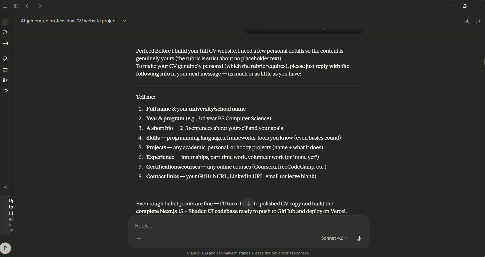
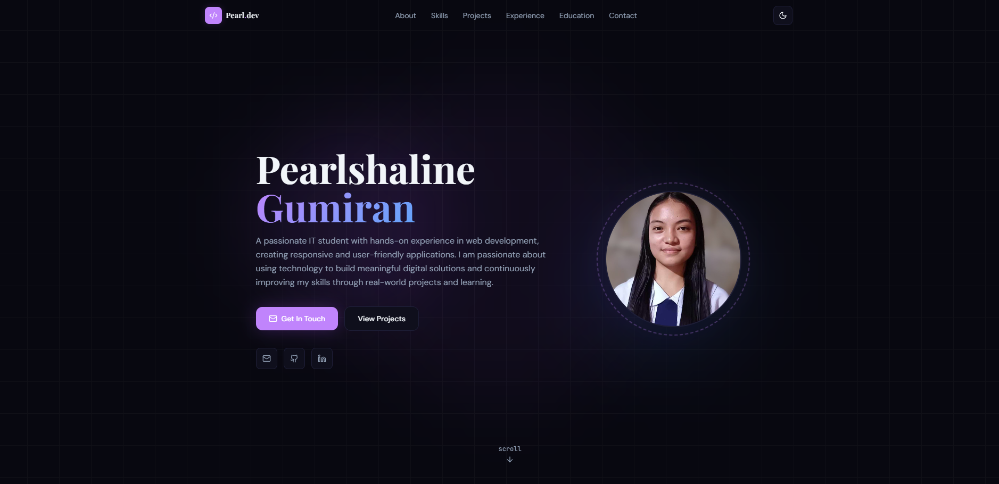
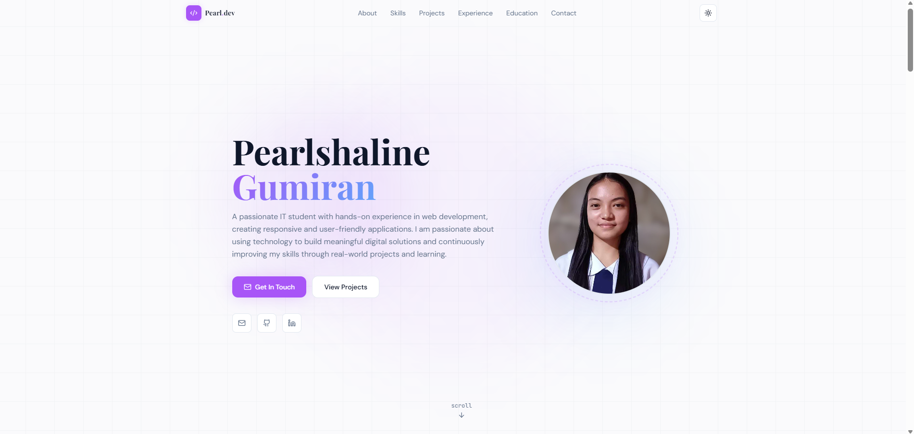
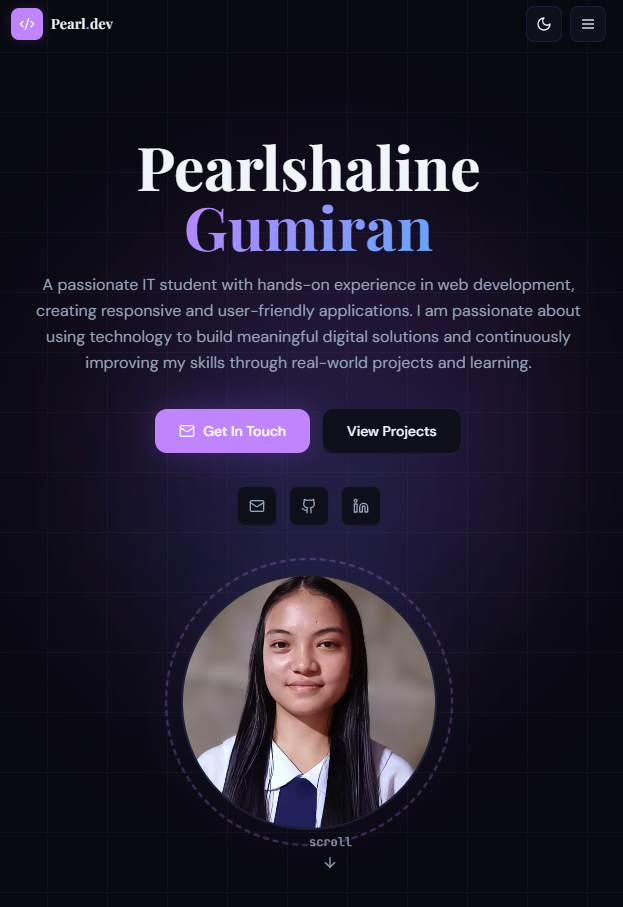

# Pearlshaline Gumiran — Professional CV Website

   

A modern, fully responsive CV/portfolio website built with AI-assisted development using **Next.js 15**, **Shadcn UI**, and **Tailwind CSS**.

🌐 **Live Demo:** [your-name.vercel.app](https://cv-website-black.vercel.app)  
📁 **Repository:** [github.com/Pearlshaline/cv-website](https://github.com/Pearlshaline/cv-website)

---

## 🤖 AI Generation Approach (v0.dev)

This project was built using **v0.dev**, Vercel's AI-powered UI generation tool, as the primary development accelerator.

### v0.dev Project
 

### Prompt Used on v0.dev

The following prompt was used to generate the initial CV website structure:

```
Create a professional CV/portfolio website using Next.js 15 and Shadcn UI 
components with the following requirements:

LAYOUT & FEATURES:
- Single-page design with smooth scroll navigation
- Dark/light mode toggle in the navbar using next-themes
- Fully responsive (mobile, tablet, desktop)
- Sticky navigation bar with name/logo and nav links

SECTIONS (in order):
1. Hero — Name, title/role, short tagline, avatar, CTA buttons
2. About — Personal bio paragraph, career summary, key highlights
3. Skills — Grid of skill cards grouped by category
4. Projects — Portfolio grid with project cards, tech stack badges, GitHub links
5. Experience — Timeline of certifications and events attended
6. Education — Cards for university and school background
7. Contact — Contact form and social links

DESIGN:
- Use Shadcn UI: Card, Badge, Button, Separator, Avatar
- Color scheme: Dark purple accent with slate background
- Typography: Playfair Display (headings) + DM Sans (body)
- Subtle scroll-triggered animations (fade in)
- Next.js 15 App Router with TypeScript
```

### AI Generation Process

| Step | Action | Tool |
|------|--------|------|
| 1 | Generated base layout and component structure | v0.dev |
| 2 | Refined dark/light mode implementation | v0.dev iterations |
| 3 | Customized with real personal content | Manual editing |
| 4 | Added scroll animations and design polish | Manual editing |
| 5 | Deployed to production | Vercel |

---

## ✨ Features Implemented

### 🌙 Dark / Light Mode
- Toggle button in the navbar (top right)
- Powered by `next-themes`
- Smooth CSS variable transitions between themes
- Defaults to **dark mode**

### Drak Mode
 

### Light mode
 

### 📱 Responsive Design
- Mobile-first layout
- Hamburger menu on small screens
- Adapts gracefully from 320px to 1440px+
(./screenshots/mobile_responsive.png)

### 🎨 Custom Design System
- CSS variables for consistent theming across dark/light modes
- Custom fonts: Playfair Display, DM Sans, JetBrains Mono
- Animated floating background orbs on hero section
- Scroll-triggered fade-in animations on all sections

### Mobile Responsive 
 

### 📄 CV Sections
| Section | Content |
|---------|---------|
| **Hero** | Name, title, bio tagline, avatar, CTA buttons, social links |
| **About** | Personal bio, career goals, quick stats |
| **Skills** | Languages, Frontend, Backend & Database, Tools & Platforms |
| **Projects** | Personal Portfolio, Mini Twitter, Movies — with GitHub links |
| **Experience** | 9 certifications, 4 events/conferences, JPCS affiliations |
| **Education** | BSIT at SPUP, Senior High, Junior High — with coursework |
| **Contact** | Contact form, email, GitHub, LinkedIn, location |

---

## 🛠 Tech Stack

| Technology | Version | Purpose |
|---|---|---|
| **Next.js** | 15.0.0 | React framework with App Router |
| **TypeScript** | 5.0 | Type-safe development |
| **Tailwind CSS** | 3.4 | Utility-first styling |
| **next-themes** | 0.3.0 | Dark/light mode toggle |
| **Lucide React** | 0.454.0 | Icon library |
| **Playfair Display** | Google Fonts | Display/heading typography |
| **DM Sans** | Google Fonts | Body typography |
| **JetBrains Mono** | Google Fonts | Code/mono typography |

---

## 📁 Project Structure

```
cv-website/
├── app/
│   ├── favicon.ico            # Browser tab icon
│   ├── globals.css            # Design system, CSS variables, animations
│   ├── layout.tsx             # Root layout with ThemeProvider & metadata
│   └── page.tsx               # Main page assembling all sections
├── components/
│   ├── theme-provider.tsx     # next-themes wrapper component
│   ├── Navbar.tsx             # Sticky navbar with dark/light toggle + mobile menu
│   ├── Hero.tsx               # Landing hero with avatar and CTAs
│   ├── About.tsx              # Bio, highlights, and quick stats
│   ├── Skills.tsx             # Categorized tech stack grid
│   ├── Projects.tsx           # Portfolio project cards with GitHub links
│   ├── Experience.tsx         # Certifications, events timeline, affiliations
│   ├── Education.tsx          # Academic background with coursework
│   ├── Contact.tsx            # Contact form and social links
│   └── Footer.tsx             # Footer with copyright
├── lib/
│   └── utils.ts               # Tailwind class merge utility (cn)
├── tailwind.config.js         # Tailwind configuration with custom fonts & animations
├── tsconfig.json              # TypeScript configuration
├── next.config.js             # Next.js configuration
├── .gitignore                 # Git ignore rules
└── README.md                  # This file
```

---

## 🚀 Getting Started

### Prerequisites
- Node.js 18.17 or later
- npm or yarn

### Installation

```bash
# 1. Clone the repository
git clone https://github.com/Pearlshaline/cv-website.git
cd cv-website

# 2. Install dependencies
npm install

# 3. Run the development server
npm run dev
```

Open [http://localhost:3000](http://localhost:3000) in your browser.

### Build for Production

```bash
npm run build
npm start
```

---

## 🌐 Deployment (Vercel)

This site is deployed on **Vercel** — the recommended platform for Next.js apps.

### Steps to Deploy

1. Push your code to a **public GitHub repository**
2. Go to [vercel.com](https://vercel.com) and sign in
3. Click **"Add New Project"**
4. **Import** your GitHub repository
5. Leave all settings as default — Vercel auto-detects Next.js
6. Click **"Deploy"** ✅

Your site will be live at `https://cv-website-black.vercel.app` 

---

## 📸 How to Add Screenshots

To complete the documentation requirements, add screenshots to a `/screenshots` folder:

```bash
mkdir screenshots
# Add these files:
# screenshots/v0-generation.png     ← screenshot of v0.dev prompt/output
# screenshots/dark-mode.png         ← screenshot of website in dark mode
# screenshots/light-mode.png        ← screenshot of website in light mode
# screenshots/mobile.png            ← screenshot of mobile responsive view
```

Then update the image references in this README.

# cv-website

